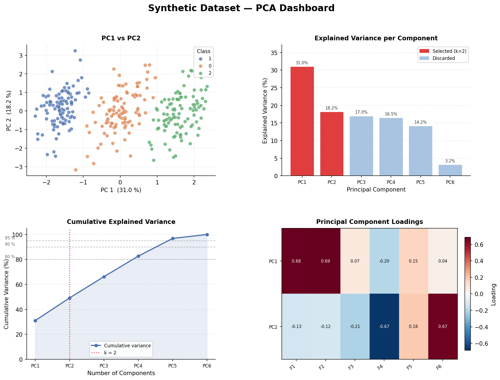
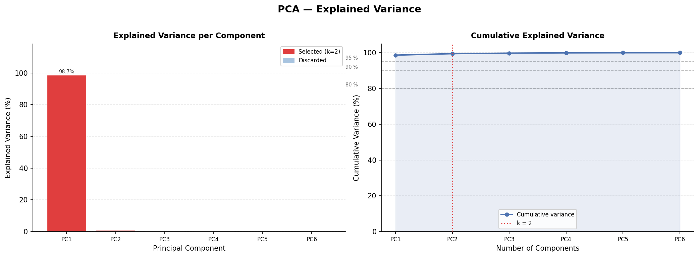
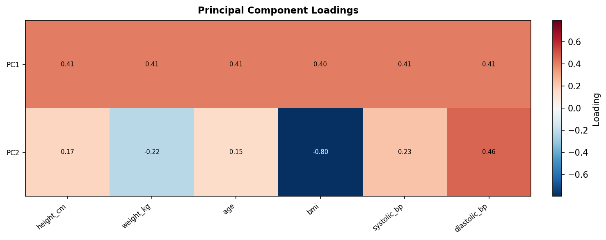
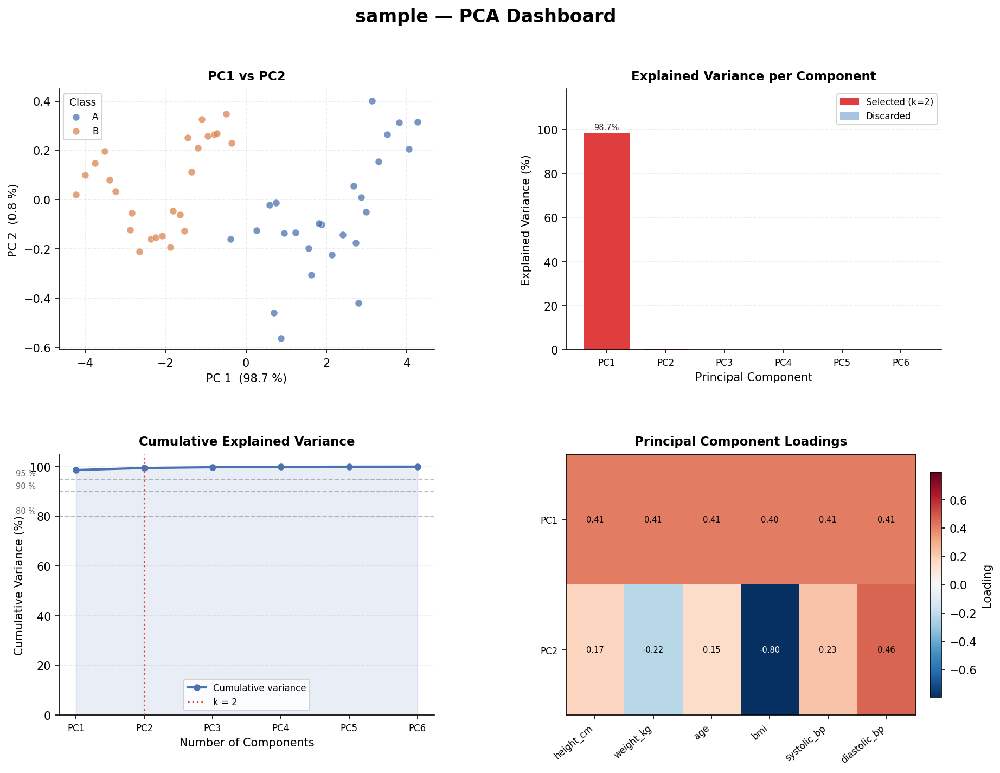

# PCA From Scratch

> **Principal Component Analysis — implemented entirely from mathematical first principles using only NumPy.**

[](https://python.org)
[](https://numpy.org)
[](#tests)
[](LICENSE)

No scikit-learn. No scipy PCA. Just linear algebra.



---

## What this project demonstrates

| Concept | Implementation |
|---------|----------------|
| Z-score standardisation | `src/utils.py::standardize` |
| Sample covariance matrix | `src/utils.py::covariance_matrix` |
| Eigen-decomposition | `numpy.linalg.eig` + custom sort |
| Explained variance ratio | Eigenvalue fractions |
| Dimensionality reduction | Matrix projection `X_std @ V_k` |
| Data reconstruction | `X_proj @ V_k.T`, un-standardise |
| Whitening transformation | Divide by `√λ` |
| Auto component selection | Float `n_components` threshold |
| Publication plots | Scree, cumulative, heatmap, scatter |

---

## Mathematical Background

### 1. Standardise

Each feature is centred and scaled so every dimension starts on equal footing:

```
X_std[:, j] = (X[:, j] - μ_j) / σ_j
```

### 2. Covariance matrix

Captures how features vary together:

```
C = (1 / (n-1))  ·  X_std.T  @  X_std        shape: (p × p)
```

`C[i, j]` is positive when features `i` and `j` increase in tandem, negative when they oppose each other.

### 3. Eigen-decomposition

```
C = V Λ Vᵀ
```

- **Eigenvalues** λ₁ ≥ λ₂ ≥ … ≥ λₚ — variance along each principal direction  
- **Eigenvectors** V — the principal directions themselves

### 4. Projection

Select the top-k eigenvectors and project:

```
X_proj = X_std @ V_k           shape: (n × k)
```

### 5. Reconstruction

Approximate the original data from the compressed representation:

```
X̂_std = X_proj @ V_k.T
X̂     = X̂_std · σ + μ
```

---

## Project Structure

```
pca-from-scratch/
│
├── README.md
├── requirements.txt
├── LICENSE
├── .gitignore
├── main.py                     ← CLI entry point
│
├── src/
│   ├── __init__.py
│   ├── pca.py                  ← PCAFromScratch class
│   ├── utils.py                ← standardize, covariance, eigenpair sort, …
│   └── visualization.py        ← all Matplotlib plotting functions
│
├── datasets/
│   └── sample.csv              ← bundled demo dataset (health measurements)
│
├── notebooks/
│   └── pca_demo.ipynb          ← step-by-step educational walkthrough
│
├── examples/
│   └── iris_demo.py            ← Iris dataset end-to-end demo
│
├── tests/
│   └── test_pca.py             ← 38 pytest tests
│
└── images/                     ← generated plots land here
```

---

## Installation

```bash
git clone https://github.com/your-username/pca-from-scratch.git
cd pca-from-scratch
pip install -r requirements.txt
```

---

## Quick Start

```python
import numpy as np
from src import PCAFromScratch

# Any 2-D numeric array
X = np.random.randn(200, 8)

# Fit and project to 2 dimensions
pca = PCAFromScratch(n_components=2)
X_2d = pca.fit_transform(X)

# Explained variance report
pca.explained_variance()

# Reconstruct and measure error
X_rec = pca.inverse_transform(X_2d)
print(pca.reconstruction_error(X))

# Visualise
pca.plot_full_dashboard(X)
```

---

## Command-Line Interface

```bash
# Two components on any CSV
python main.py --input datasets/sample.csv --components 2 --label label

# Auto-select components to explain 95 % of variance
python main.py --input data.csv --variance 0.95

# Apply whitening and save the transformed CSV
python main.py --input data.csv --components 3 --whiten --save-csv out.csv

# Run the built-in synthetic demo (no file needed)
python main.py --demo
```

---

## Example: Iris Dataset

```bash
python examples/iris_demo.py
```

The 150-flower, 4-feature Iris dataset is downloaded automatically from the UCI repository. PCA compresses it from 4 → 2 dimensions while keeping ~97 % of the variance, and the three species become clearly linearly separable in the projection.

**Reconstruction error vs k:**

| k | MSE   | Cumulative variance |
|---|-------|---------------------|
| 1 | 0.48  | 72.8 %              |
| 2 | 0.10  | 97.7 %              |
| 3 | 0.02  | 99.5 %              |
| 4 | ~0.00 | 100.0 %             |

---

## Class API

```python
class PCAFromScratch:

    # Constructor
    PCAFromScratch(n_components=None, whiten=False)

    # Fit
    .fit(X)                    # learn from X

    # Transform
    .transform(X)              # project new X onto learned axes
    .fit_transform(X)          # fit + transform in one call

    # Inverse
    .inverse_transform(X_proj) # reconstruct approximate original data

    # Diagnostics
    .explained_variance(verbose=True)   # print + return variance summary
    .reconstruction_error(X)           # mean squared error

    # Plots
    .plot_variance(figsize, save_path)
    .plot_projection(X, labels, feature_names, save_path, title)
    .plot_eigenvectors(feature_names, save_path)
    .plot_full_dashboard(X, labels, feature_names, save_path, title)

    # Export
    .save_transformed(X, path, labels)  # write projected CSV

    # Attributes (after fit)
    .components_                   # (k, p) loading matrix
    .explained_variance_           # eigenvalues for selected components
    .explained_variance_ratio_     # fraction of total variance
    .cumulative_variance_ratio_    # cumulative fraction
    .mean_  .std_                  # training standardisation params
```

### `n_components` modes

| Value | Behaviour |
|-------|-----------|
| `int` (e.g. `2`) | Keep exactly that many components |
| `float` (e.g. `0.95`) | Keep enough to explain 95 % of variance |
| `None` | Keep all components (no reduction) |

---

## Utility Functions

```python
from src.utils import (
    standardize,                     # Z-score normalisation
    covariance_matrix,               # manual Σ computation
    sort_eigenpairs,                  # sort λ, V descending
    reconstruction_error,            # MSE(X, X̂)
    select_n_components_by_variance, # minimum k for threshold
    make_synthetic_dataset,          # clustered Gaussian data
    load_csv,                        # CSV → numpy + labels
)
```

---

## Tests

```bash
pytest tests/ -v
```

```
38 passed in 2.57s
```

Test classes:
- `TestStandardize` — zero mean, unit std, warning on constant column
- `TestCovarianceMatrix` — shape, symmetry, matches numpy, diagonal ≈ 1
- `TestSortEigenpairs` — descending order, eigenvectors follow
- `TestPCAFitTransform` — shapes, zero-centred projection, error handling
- `TestInverseTransform` — perfect at full rank, degrades with lower k
- `TestExplainedVariance` — sums to 1, descending, cumulative monotone, float mode
- `TestWhiten` — unit variance, invertible
- `TestSelectNComponents` — covers threshold, invalid input
- `TestReconstructionError` — zero for identical, positive otherwise
- `TestMakeSyntheticDataset` — shape, class count
- `TestRepr` — fitted/unfitted states

---

## Visualisations

| Plot | Method | Preview |
|------|--------|---------|
| 2-D PCA scatter with class colours | `plot_projection()` | *(see dashboard)* |
| Explained variance bar + cumulative | `plot_variance()` |  |
| Principal component loadings heatmap | `plot_eigenvectors()` |  |
| Full 4-panel dashboard | `plot_full_dashboard()` |  |
| 3-D PCA scatter | `plot_3d_projection()` (standalone) | |
| Before / after side-by-side | `plot_before_after()` (standalone) | |

---

## Future Improvements

- Incremental / online PCA for datasets too large to fit in memory
- Kernel PCA for non-linear dimensionality reduction
- Sparse PCA via L1-penalised loadings
- Factor analysis comparison notebook
- Interactive Plotly/Bokeh visualisations
- Comparison against scikit-learn output (for validation only)

---

## References

1. Jolliffe, I.T. (2002). *Principal Component Analysis*, 2nd ed. Springer.
2. Shlens, J. (2014). [A Tutorial on Principal Component Analysis](https://arxiv.org/abs/1404.1100). arXiv:1404.1100.
3. NumPy — [numpy.linalg.eig](https://numpy.org/doc/stable/reference/generated/numpy.linalg.eig.html)
4. UCI ML Repository — [Iris dataset](https://archive.ics.uci.edu/ml/datasets/iris)

---

## License

MIT — see [LICENSE](LICENSE).
